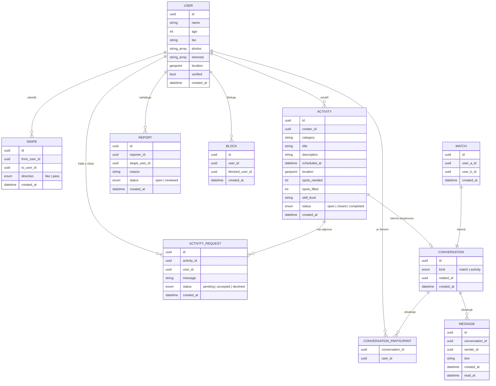

# Návrh mobilní aplikace na hledání kamarádů (pracovní název: **Parta**)

> Tinder pro kamarádství, ne pro rande. Dva způsoby seznámení: **swipe
> profilů** v okolí a **nástěnka aktivit**, kde lidé hledají parťáka na
> konkrétní věc (posilovna, lezení, výlet, cestování...) a ostatní se k
> tomu můžou přihlásit.

Cílový trh: Česko. Dokument slouží jako výchozí specifikace pro vývoj —
funkce, toky, datový model, technologie a plán fází. Vizuální mockupy
klíčových obrazovek jsou samostatně (odkaz dostaneš v chatu).

## Obsah

1. [Koncept a odlišení od Tinderu/Bumble](#1-koncept-a-odlišení-od-tinderubumble)
2. [Cílová skupina](#2-cílová-skupina)
3. [Informační architektura](#3-informační-architektura)
4. [Funkce](#4-funkce)
5. [Uživatelské toky](#5-uživatelské-toky)
6. [Datový model](#6-datový-model)
7. [Přehled obrazovek](#7-přehled-obrazovek)
8. [Bezpečnost a moderace](#8-bezpečnost-a-moderace)
9. [Technologický návrh](#9-technologický-návrh)
10. [Monetizace](#10-monetizace-volitelné)
11. [MVP a fáze rozvoje](#11-mvp-a-fáze-rozvoje)
12. [Rizika a otevřené otázky](#12-rizika-a-otevřené-otázky)
13. [Další kroky](#13-další-kroky)

---

## 1. Koncept a odlišení od Tinderu/Bumble

Základní mechanika swipe seznamování (karty, like/pass, match → chat) je
z Tinderu dobře známá a osvědčená — přebírá se 1:1, jen bez romantického
rámce (žádné "rande", filtr pohlaví je volitelný a slouží jen k
personalizaci, ne k seznamovacímu záměru).

Nejbližší reálná konkurence je **Bumble BFF** (friend-mode Bumble) a
částečně **Meetup** nebo lokální FB skupiny. Odlišení téhle aplikace:

- **Nástěnka aktivit je rovnocenný druhý mód**, ne doplněk. Řeší
  konkrétní, akční potřebu ("hledám parťáka na tuhle věc, tenhle
  týden"), místo abstraktního "najdi si nového kamaráda podle profilu".
  To je nižší bariéra k prvnímu kontaktu — lidi se scházejí kolem
  aktivity, ne kolem "seznamování".
- Cílem je jasně **jen přátelství**, což mění tón, bezpečnostní prvky i
  to, jak se řeší např. rozdíl věku nebo pohlaví ve filtrech.

## 2. Cílová skupina

- Lidé po přestěhování do nového města (práce, škola) bez sociální sítě.
- Lidé hledající parťáka na konkrétní koníček, kde je těžké najít
  spoluhráče (lezení, běhání, deskovky, cizí jazyk...).
- Lidé plánující cestu/výlet a hledající spolucestovatele.
- Introvertnější lidé, kterým vadí seznamovat se "naslepo" bez záminky —
  aktivita je přirozená záminka.

Věkové omezení **18+** (kvůli seznamování cizích lidí osobně — viz
bezpečnost).

## 3. Informační architektura

Spodní tab bar, 4 záložky:

```
┌──────────┬──────────┬──────────┬──────────┐
│ Objevuj  │ Aktivity │  Zprávy  │  Profil  │
│ (swipe)  │ (nástěnka)│ (chat)  │          │
└──────────┴──────────┴──────────┴──────────┘
```

Obě hlavní cesty (swipe i aktivity) vedou do stejného chatu/matche —
sjednocený inbox, uživatel neřeší, jestli konverzace vznikla ze swipe
matche nebo z přihlášení na aktivitu.

## 4. Funkce

### 4.1 Objevuj (swipe mód)

- Kartový stack profilů v okolí: foto, jméno, věk, krátké bio, tagy
  zájmů, vzdálenost, případně "shodné zájmy" zvýrazněné.
- Swipe doprava = líbí se mi, doleva = přeskočit, tap na kartu = detail
  profilu (více fotek, delší bio).
- Vzájemný like → obrazovka **Match** → tlačítko "Napsat zprávu".
- Filtry: vzdálenost, věkové rozmezí, konkrétní zájmy/kategorie.

### 4.2 Aktivity (nástěnka)

- Feed příspěvků „Hledám parťáka/y na...". Kategorie: sport (posilovna,
  běhání, lezení, kolo...), outdoor/cestování (výlet, backpacking,
  hory), kultura (kino, koncert), hry/deskovky, jazyky, jídlo/kavárny,
  ostatní.
- Karta příspěvku: kategorie, název, kdy (konkrétní termín / "kdykoli
  tento týden" / opakující se), přibližná lokalita, kolik lidí ještě
  hledá (např. "2/1 obsazeno"), úroveň (začátečník/pokročilý — hodí se
  hlavně pro sport), mini-profil autora.
- Detail aktivity → tlačítko **„Mám zájem"** → autorovi přijde žádost se
  zprávou → autor schválí/odmítne → po schválení se otevře chat (1:1
  nebo skupinový, pokud aktivita hledá víc lidí najednou).
- Filtry a vyhledávání: kategorie, vzdálenost, datum, jen „aktivní"
  (ještě hledá lidi).
- Vytvoření aktivity: kategorie → název a popis → kdy → kde (mapa,
  jen přibližná poloha, přesné místo se sdílí až po schválení) → kolik
  lidí hledám → volitelně úroveň/foto.

### 4.3 Zprávy

- Sjednocený seznam konverzací (matches i schválené aktivity, skupinové
  i 1:1), řazeno podle poslední aktivity.
- Chat: text, později lze doplnit sdílení polohy/fota.

### 4.4 Profil

- Editace: fotky (min. 2, max. 6), jméno, věk, bio, tagy zájmů.
- „Moje aktivity": vytvořené (se seznamem čekajících žádostí ke
  schválení) a ty, na které se uživatel přihlásil.
- Odznaky: ověřený profil, případně počet úspěšných "seznámení".
- Nastavení: dosah vyhledávání, viditelnost profilu (zapnout/vypnout
  discovery), notifikace, blokovaní uživatelé, nahlásit problém, smazat
  účet.

## 5. Uživatelské toky

**Onboarding:** registrace (telefon/e-mail/Apple/Google) → ověření →
profil (fotky, jméno, věk, bio) → výběr zájmů (tagy) → poloha → krátké
bezpečnostní pravidla („tahle appka je na kamarádství") → notifikace.

**Swipe → match → chat:**
`Objevuj → swipe right → (vzájemný like) → Match obrazovka → Napsat zprávu → Chat`

**Aktivita → přihlášení → chat:**
`Aktivity → filtr/hledání → detail aktivity → Mám zájem (+ zpráva) → čekání na schválení → autor schválí v "Moje aktivity" → Chat (skupinový, pokud víc lidí)`

**Vytvoření aktivity:**
`Profil/Aktivity → + Nová aktivita → formulář → publikovat → sleduju žádosti v "Moje aktivity" → schvaluji/odmítám`

## 6. Datový model



`MATCH` vzniká automaticky, když existují dva `SWIPE` záznamy s
opačným směrem mezi stejnou dvojicí (`A→B: like` i `B→A: like`).
`CONVERSATION` s `kind = activity` může mít víc než 2 účastníky
(`CONVERSATION_PARTICIPANT`), `kind = match` vždy přesně 2.

## 7. Přehled obrazovek

| Obrazovka | Účel |
|---|---|
| Onboarding / registrace | vysvětlení konceptu, registrace, ověření |
| Vytvoření profilu | fotky, jméno, věk, bio, zájmy |
| Preference | dosah, věkové rozmezí, kategorie zájmů |
| Objevuj (swipe) | kartový stack profilů |
| Match | animace při shodě, CTA „napsat zprávu" |
| Detail profilu | rozšířené info o druhém uživateli |
| Nástěnka aktivit | feed příspěvků + filtry |
| Detail aktivity | popis, mapa, autor, tlačítko „mám zájem" |
| Vytvořit aktivitu | formulář na nový příspěvek |
| Moje aktivity | vytvořené + přihlášené, správa žádostí |
| Zprávy (seznam) | přehled konverzací |
| Chat | 1:1 nebo skupinová konverzace |
| Profil | vlastní profil, editace, odznaky |
| Nastavení | soukromí, notifikace, blokovaní, nahlášení, smazání účtu |

Vizuální mockupy pro klíčové obrazovky (Objevuj, Match, Nástěnka
aktivit, Detail aktivity, Chat) — samostatný odkaz na náhled, viz konec
zprávy v chatu.

## 8. Bezpečnost a moderace

U aplikace, která svádí cizí lidi k osobnímu setkání, je bezpečnost
základ, ne doplněk:

- **Nahlášení a blokování** uživatele i konkrétní aktivity, dostupné z
  každého profilu/detailu/chatu.
- **Ověření profilu** (selfie porovnané s profilovkou) — volitelný
  odznak „ověřeno", zvyšuje důvěryhodnost, případně jde časem udělat
  podmínkou pro vytváření aktivit.
- **Nepřesná poloha na veřejnosti** — na nástěnce a v profilu se
  ukazuje jen přibližná vzdálenost/oblast, přesná adresa/místo srazu se
  sdílí až po schválení účasti.
- **Automatická moderace fotek** (rozpoznávání nevhodného obsahu) plus
  ruční review nahlášení — při malém provozu v MVP stačí ruční review,
  automatika se hodí až při škálování.
- **Bezpečnostní tipy v appce**: první schůzku na veřejném místě, dát
  vědět kamarádovi kam jdu, appka nezprostředkovává platby ani
  neověřuje totožnost navenek.
- **Rate limiting**: omezení počtu založených aktivit a žádostí za den
  kvůli spamu.
- **GDPR**: appka běží v EU, ukládá citlivá data (poloha, fotky) —
  nutné DPA se zvoleným backend poskytovatelem, možnost exportu/smazání
  dat z appky (souvisí s „smazat účet" v nastavení).

## 9. Technologický návrh

| Vrstva | Doporučení | Poznámka |
|---|---|---|
| Mobilní frontend | React Native + Expo (TypeScript) | jedna codebase pro iOS i Android, rychlý start |
| Backend / BaaS | Supabase (Postgres + PostGIS, Auth, Storage, Realtime) | EU region hostingu kvůli GDPR; PostGIS pro "najdi lidi/aktivity do X km" |
| Realtime chat | Supabase Realtime (nebo Firestore/Stream Chat, pokud by Supabase realtime nestačilo) | stačí pro MVP objem zpráv |
| Push notifikace | Expo Notifications (FCM/APNs pod kapotou) | match, nová žádost, schválení, nová zpráva |
| Mapy/geokódování | Mapy.cz API (lokální data pro ČR) nebo Google Maps | Mapy.cz může mít lepší pokrytí menších měst v ČR |
| Moderace fotek | Google Cloud Vision SafeSearch / AWS Rekognition | zapojit až při větším provozu, MVP ruční review |
| Analytika | PostHog (self-host nebo EU cloud) | product analytics + GDPR-friendly |
| CI/CD, buildy | EAS (Expo Application Services) | buildy pro App Store/Play Store, OTA update JS části |

## 10. Monetizace (volitelné)

Freemium model, jádro appky zdarma:

- **Parta+** (např. 99–149 Kč/měsíc): neomezené likes, vidět kdo mě
  liknul, zvýraznění vlastní aktivity na nástěnce ("boost"), pokročilé
  filtry, undo swipe.
- Bez skrytých plateb za základní bezpečnost (nahlášení, blokování) —
  to musí zůstat zdarma vždy.

## 11. MVP a fáze rozvoje

| Fáze | Rozsah |
|---|---|
| **MVP** | Profil, swipe + match, základní 1:1 chat, nástěnka aktivit (vytvoření/prohlížení/žádost/schválení), nahlášení a blokování, ruční moderace |
| **Fáze 2** | Push notifikace, pokročilé filtry, ověření fotek, skupinové chaty pro aktivity s víc účastníky, „boost" aktivity |
| **Fáze 3** | Komunity/skupiny podle zájmu, hodnocení po proběhlé aktivitě, automatická moderace fotek, prémiové předplatné |

## 12. Rizika a otevřené otázky

- **Cold start problem** — swipe i nástěnka potřebují kritické množství
  aktivních lidí v jedné lokalitě, jinak je appka prázdná. Warto zvážit
  launch nejdřív v jednom městě/komunitě (např. přes existující
  komunity/FB skupiny) místo celé ČR najednou.
- **Bezpečnost při osobním setkání** — appka může jen doporučovat
  bezpečné chování, ne ho vynutit; stojí za to od začátku promyslet
  proces nahlášení/reakce na incident, ne ho řešit až dodatečně.
- **Diferenciace vs. Bumble BFF** — swipe část sama o sobě nebude
  jedinečná, hlavní odlišení je nástěnka aktivit; stojí za zvážení dát
  jí v produktu větší váhu než swipe módu (např. jako výchozí obrazovku).
- **Poměr swipe vs. aktivity** — jestli mají být rovnocenné, nebo jestli
  je jedna z nich hlavní a druhá doplňková, se nejlíp ověří až s
  reálnými uživateli.

## 13. Další kroky

- Vizuální mockupy klíčových obrazovek — samostatný odkaz (viz chat).
- Na vyžádání: založit v repu kostru mobilní appky (Expo + TypeScript
  projekt) podle téhle specifikace.
- Zajímavý (nepovinný) nápad na propojení s existujícím projektem v
  tomhle repu: `docs/data/lessons.json` z Brno Fit Rozvrhu by šel použít
  jako zdroj pro předvyplněné aktivity typu „hledám parťáka na lekci
  jógy v X v Y hodin" — čistě nápad do budoucna, není součástí MVP.
